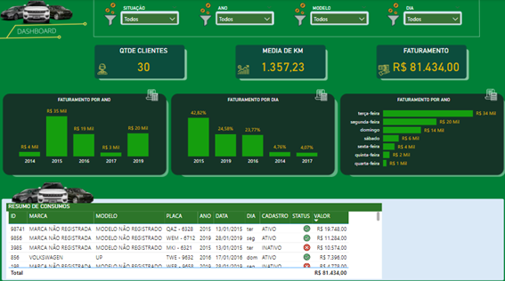

# Dashboard Power BI - Locadora de Veículos

## Descrição
Este projeto apresenta um dashboard interativo desenvolvido no Power BI para análise de dados de uma locadora de veículos. Ele fornece insights estratégicos sobre faturamento, clientes, quilometragem média e desempenho anual e semanal, ajudando na tomada de decisões empresariais.

## Visão Geral do Dashboard

## Principais Funcionalidades
- **Indicadores Chave**:
  - Faturamento total e ticket médio.
  - Quantidade de clientes ativos e inativos.
  - Quilometragem média percorrida.

- **Análises**:
  - Faturamento por ano e dia da semana.
  - Gráficos de tendência e evolução do faturamento (2014-2019).
  - Controle de veículos por categoria e status de cadastro.

)

- **Detalhamento de Dados**:
  - Listagem de clientes cadastrados e não cadastrados.
  - Resumo de veículos com marca, modelo, placa e valor faturado.

## Gráfico de Tendências

)

## Ferramentas Utilizadas
- **Microsoft Power BI**: Construção do dashboard e visualizações interativas.
- **Microsoft Power Query**: Tratamentos de dados
- **ETL**: Limpeza e tratamento da base de dados.
- **Análise de Dados**: Identificação de padrões e tendências.

## Insights Obtidos

1. **Desempenho Anual**:
   - O faturamento atingiu o pico em 2015, com R$ 45 mil, seguido por uma queda em 2016 e recuperação em 2019 (R$ 20 mil).
   - A tendência sugere a necessidade de avaliar o que influenciou a queda de 2016 a 2017 e a retomada em 2019.

2. **Faturamento por Dia da Semana**:
   - Terça-feira lidera com o maior faturamento (R$ 24 mil), enquanto quarta-feira tem o menor desempenho (R$ 1 mil).
   - Pode haver uma oportunidade para promoções ou estratégias de marketing específicas nos dias de menor movimento.

3. **Clientes**:
   - Dos 30 clientes registrados, 75,22% estão ativos, enquanto 24,78% estão inativos, indicando potencial de reativação de clientes antigos.
   - Clientes não cadastrados representam uma oportunidade de formalização e possível aumento de receita.

4. **Controle de Veículos**:
   - Uma parcela significativa dos veículos está classificada como "Marca Não Registrada", o que sugere a necessidade de padronização e melhoria nos registros para análises mais detalhadas.
   - A maioria dos veículos pertence à categoria "Light", enquanto a categoria "Luxo" é minoritária, o que pode influenciar as margens de lucro dependendo da estratégia de preços.

5. **Ticket Médio**:
   - O ticket médio está em R$ 5.191,78, o que sugere um bom desempenho para locações de médio a longo prazo.
   - Pode ser interessante identificar quais tipos de clientes ou veículos contribuem mais para esse valor e focar neles.

6. **Distribuição Regional**:
   - A empresa opera em 3 cidades, mas o impacto de cada cidade no faturamento não é claro no painel atual. Isso pode ser uma oportunidade de expandir a análise regional.

7. **Performance da Frota**:
   - Quilometragem média de 1.357,23 km por veículo sugere um uso moderado da frota, mas é importante avaliar se isso está alinhado com o planejamento de manutenção.

8. **Crescimento Potencial**:
   - A receita total de R$ 81.434,00 sugere espaço para crescimento, considerando a base de clientes e a possibilidade de explorar novos mercados ou categorias de veículos.

9. **Fidelização de Clientes**:
   - Clientes com faturamento recorrente indicam uma boa taxa de retenção, mas é necessário analisar a periodicidade das locações para maximizar o valor de cada cliente ao longo do tempo.

10. **Sazonalidade**:
    - Embora o painel não detalhe sazonalidades mensais, a análise de anos e dias da semana sugere flutuações que podem ser exploradas com campanhas promocionais em períodos mais fracos.

## Como Abrir o Projeto
1. Certifique-se de ter o **Microsoft Power BI Desktop** instalado.
2. Abra o arquivo `.pbix` no Power BI.
3. Explore os gráficos e filtros para obter insights personalizados.

## Próximos Passos
- Atualizar a base de dados periodicamente.
- Incorporar análises preditivas para projeções futuras.
- Refinar os filtros e indicadores com base no feedback.

---

**Autor:** [LUCAS SOUZA]  
**Contato:** [eng.lucassouzas@gmail.com]
